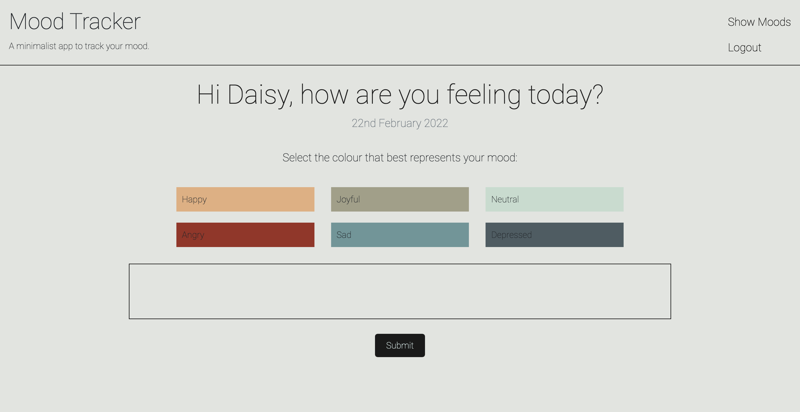
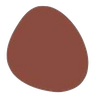
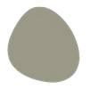

# MOOD TRACKER

## Description
Living with  Autism, ADHD, Depression and Bipolar can sometimes be extremely challenging with minor things that can effect mood immensely. I have created a mood tracker for adults predominately dealing with Autism and other behavioural and mood disorders so they can monitor their emotions and moods to recognise any patterns or triggers. 

## User Story
AS A person with Autism 
I WANT an app that can track my mood
SO THAT I can look for patterns in how my mood can vary due to situations/circumstances.

## Technologies Used
* React for the front end.
* GraphQL with Node.js and Express.js server.
* MongoDB for the database.
* and the app was deployed to Heroku.

## Mock-Up
Please [click here](https://git.heroku.com/peaceful-escarpment-09910.git) to view my live webpage.

Below is a screen capture of my full webpage!

Color and Autism:
Autistic people can oftentimes view colors a little more vividly then neurotypicals and the use of duller colors - such as pale pinks, blues and greens - and colors with white and grey undertones, have been shown to have a more calming effect on children on the spectrum. I myself, have always had an infinity to very neutral and earthy colors so I decided to use this for my app and create something that did not have intense colors or stark whites.

I have also kept my app veryy minimalistic. As someone who is on the spectrum, I find simplicity more calming.

## Future Development & Missing Pieces
In the future, I would want to make this mood tracker a bit more user friendly, and have more that the user can do like setting their mood dates for 7 days, 14 days, a month and a year and letting them view for these times. I would also like the user to be able to click on any color in the grid and be able to view the mood and description for that day to see why they felt that way. I would also make the user interface look a lot nicer.

## Credits
[Madeleine Cosway](https://github.com/madeleinesc) 🤠
